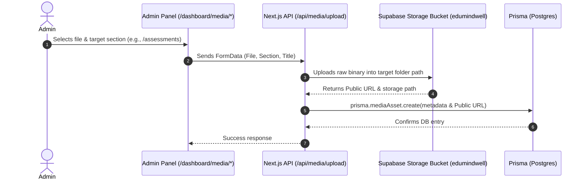

# SSOT: Media Management & Migration Mapping

This Single Source of Truth (SSOT) serves as the reference mapping for integrating dynamic media uploads, admin control panels, and the public landing page components using Supabase Storage and Prisma PostgreSQL.

| Website Area / Section | Admin Management Route | Local Public Assets | Supabase Storage Folder | DB Model Mapping (`MediaAsset`) | Frontend File to Modify |
| :--- | :--- | :--- | :--- | :--- | :--- |
| **Career Assessment & Counselling Galleries** (Gallery Page tabs & Carousel) | `/dashboard/media/assessment` | `/public/assessments/*` (e.g. `IMG-...jpg`, `VID-...mp4`) | `assessments/` | `section = GALLERY` `type = IMAGE \| VIDEO` | [GalleryCollageSection.tsx](file:///d:/Oraganisation/Dabal/my-app/components/landing/GalleryCollageSection.tsx) [GallerySection.tsx](file:///d:/Oraganisation/Dabal/my-app/components/landing/GallerySection.tsx) |
| **Mindset Workshops (Top Highlights Grid)** (Home page `#workshops` top 3 items) | `/dashboard/media/workshops` | `/public/workshop/*` (e.g., `IMG-...jpg`, `VID-...mp4`) | `workshop/` | `section = WORKSHOPS` `type = IMAGE \| VIDEO` | [AudienceSection.tsx](file:///d:/Oraganisation/Dabal/my-app/components/landing/AudienceSection.tsx) |
| **Mindset Workshops (Audience Cards)** (Home page Student, Parent, Teacher banner covers) | `/dashboard/media/workshops` | `/StudentMindset.jpeg` `/ParentMindset.jpeg` `/ProMindset.jpeg` | `workshop/covers/` | `section = WORKSHOPS` `type = IMAGE` (Custom metadata tag) | [AudienceSection.tsx](file:///d:/Oraganisation/Dabal/my-app/components/landing/AudienceSection.tsx) (Card mapping) |
| **Wellness Media & Service Cards** (Gallery Page tab & Home page `#wellness` cards) | `/dashboard/media/wellness` | `/public/Wellness/*` `/MiracleX.jpeg` `/Therapeutic.jpeg` `/oneToOne.jpeg` `/groupMed.jpeg` `/LearningVideo.jpeg` | `wellness/` | `section = WELLNESS` `type = IMAGE \| VIDEO` | [WellnessSection.tsx](file:///d:/Oraganisation/Dabal/my-app/components/landing/WellnessSection.tsx) [GalleryCollageSection.tsx](file:///d:/Oraganisation/Dabal/my-app/components/landing/GalleryCollageSection.tsx) |
| **Hero Section Media** (Home page `#hero` right column optional video/banner) | `/dashboard/media/hero` (or generic admin settings) | *None* (Currently raw CSS animations only) | `hero/` | `section = GALLERY` `placement = HERO` | [HeroSection.tsx](file:///d:/Oraganisation/Dabal/my-app/components/landing/HeroSection.tsx) |

---

## Technical Flow Overview

---

## Action Items Checklist

### 1. SDK & Configuration
- [x] Install `@supabase/supabase-js` package.
- [x] Create [supabase.ts](file:///d:/Oraganisation/Dabal/my-app/lib/supabase.ts) helper client.
- [x] Add Sidebar category **"Media Galleries"** with sub-links in [layout.tsx](file:///d:/Oraganisation/Dabal/my-app/app/%28dashboard%29/layout.tsx).

### 2. Backend API Setup
- [x] Create `/api/media/upload` route to support dynamic folders (`assessments/`, `wellness/`, `workshop/`, `hero/`).
- [x] Create `/api/media` route to handle listing (`GET`), updating (`PUT`), and deleting (`DELETE`).

### 3. Admin Uploader Views
- [x] Build `/dashboard/media/assessment` gallery manager.
- [x] Build `/dashboard/media/wellness` gallery manager.
- [x] Build `/dashboard/media/workshops` gallery manager.
- [x] Build `/dashboard/media/hero` banner/video manager.

### 4. Public Page Refactoring
- [x] Modify [GallerySection.tsx](file:///d:/Oraganisation/Dabal/my-app/components/landing/GallerySection.tsx) & [GalleryCollageSection.tsx](file:///d:/Oraganisation/Dabal/my-app/components/landing/GalleryCollageSection.tsx) to fetch dynamically.
- [x] Modify [AudienceSection.tsx](file:///d:/Oraganisation/Dabal/my-app/components/landing/AudienceSection.tsx) to fetch dynamically.
- [x] Modify [WellnessSection.tsx](file:///d:/Oraganisation/Dabal/my-app/components/landing/WellnessSection.tsx) to fetch dynamically.
- [x] Add optional image/video display to [HeroSection.tsx](file:///d:/Oraganisation/Dabal/my-app/components/landing/HeroSection.tsx).

### Upload metadata conventions

For workshop audience card covers, set the upload title to `COVER:Students`, `COVER:Parents`, or `COVER:Teachers / Professionals`. Wellness card uploads replace the matching fallback card when their title exactly matches the card title. Hero uses the first published asset returned by `/api/media?section=HERO`.
